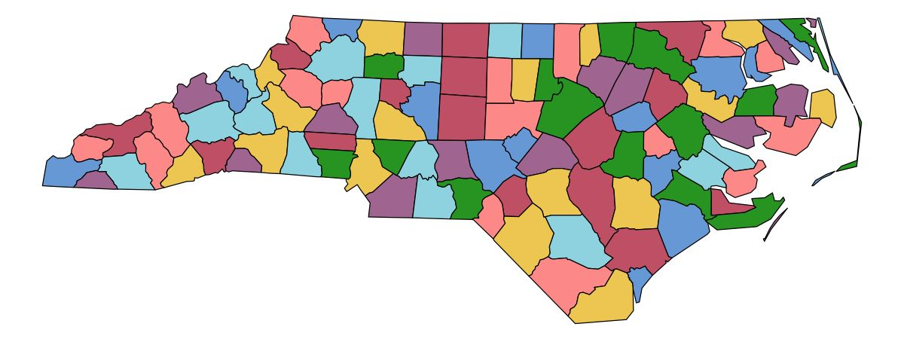

<!-- README.md is generated from README.Rmd. Please edit that file -->

```{r setup, include = FALSE}
knitr::opts_chunk$set(
  collapse = TRUE,
  comment = "#>",
  fig.path = "man/figures/README-"
)
hook_output <- knitr::knit_hooks$get("output")
knitr::knit_hooks$set(output = function(x, options) {
   lines <- options$output.lines
   if (is.null(lines)) {
     return(hook_output(x, options))  # pass to default hook
   }
   x <- unlist(strsplit(x, "\n"))
   more <- "..."
   if (length(lines)==1) {        # first n lines
     if (length(x) > lines) {
       # truncate the output, but add ....
       x <- c(head(x, lines), more)
     }
   } else {
     x <- c(more, x[lines], more)
   }
   # paste these lines together
   x <- paste(c(x, ""), collapse = "\n")
   hook_output(x, options)
 })
```

# Colors for all! <a href="https://mtennekes.github.io/cols4all/"></a>


<!-- badges: start --->
[](https://cran.r-project.org/package=cols4all) 
[](https://cran.r-project.org/web/checks/check_results_cols4all.html)
[](https://www.r-pkg.org/pkg/cols4all)
<!-- badges: end --->


**cols4all** is an R package for selecting color palettes. "Color for all" refers to our mission that colors should be usable for not just people with normal color vision, but also for people with color vision deficiency. Currently, this package contains palettes from several popular and lesser known color palette series. Users can also add their own palette series.

Color palettes are well organized and made consistent with each other. Moreover, they are scored on several aspects: color-blind-friendliness, the presence of intense colors (which should be avoided), the overall aesthetic harmony, and how many different hues are used. Finally, for each color palette a color for missing values is assigned, which is especially important for spatial data visualization. Currently we support several types: *categorical* (qualitative) palettes, *sequential* palettes, *diverging* palettes, *cycling* palettes and *bivariate* palettes (divided into four subtypes).

## Installation

**cols4all** is available on CRAN:

```{r, eval=FALSE}
install.packages("cols4all", dependencies = TRUE)
```

The development version can be installed as follows:

```{r, eval=FALSE}
install.packages("remotes")
remotes::install_github("mtennekes/cols4all", dependencies = TRUE)
```


```{r, echo=FALSE, message=FALSE}
devtools::load_all(".")
```


## Getting started

Load the package:

```{r, eval=FALSE}
library(cols4all)
```

The main tool is a dashboard, which is started with:

```{r, eval=FALSE}
c4a_gui()
```

[](vignettes/articles/cols4all2.jpg)


What palettes are available? That is, by default; other palettes can be added!


```{r}
c4a_series()
```

## Using the tool

Use the tool to compare palettes and if needed analyse a palette in depth (via the other tabs).

Find a trade-off you like among the following properties (the columns in the main table):

* Colorblind friendly: Is the palette color blind friendly?
* Fair: Is the palette fair? In a fair palette, colors stand out about equally. 
* Hues: What hue ranges are used? All across the (rainbow) color spectrum, or a limited range?
* Vivid: Are there any colors that are very saturated? Perhaps a little too much?
* Contrast: Is there sufficient contrast against white, black (using WACG criteria) and between colors?
* 3D Blues: If blue is a palette color, a 3D visual illusion could appear.
* Naming (in development): How well can palette colors be named?

### Example 1 

When we are looking for a fair categorical palette of seven colors that is as color blind friendly as possible, then filter on "Fair", and sort by "Colorblind-friendly":

[](vignettes/articles/cols4all_fair_sort_cbf.jpg)


This inspired us to develop our own palettes: see these `cols4all` palettes below.

### Example 2

Say we need a diverging palette that is color blind friendly, and what to choose one by eye. Then filter by "Colorblind-friendly" and sort by "Hue Middle L" (the hue of the left wing):

[](vignettes/articles/cols4all_div.jpg)

Reverse sorting is also applied.

## Preliminary set of new `cols4all` palettes

We applied a basic heuristic to explore palettes that score well on a mix of the properties named above

[](vignettes/articles/c4a_pals.jpg)

`area7`, `area8` and `area9` are fair, contain low pastel colors, and are color-blind friendly (up to 7 colors). So ideal for maps and other space-filling visualizations! These are used in [https://github.com/r-tmap/tmap](`tmap4`).

[](vignettes/articles/area7.jpg)

`area7d`, `area8d` and `area9d` similar but for dark mode:.

[](vignettes/articles/area7d.jpg)


`line7`, `line8` and `line9` are colors with good contrast against both black and white, and are also colorblind-friendly to some extent. So ideal for line graphs and scatter plots:

[](vignettes/articles/line7_wt.jpg)
[](vignettes/articles/line7_bk.jpg)

Finally `friendly7` ... `friendly13` are colorblind-friendly palettes (disregarding the other properties):

[](vignettes/articles/friendly13.jpg)


## `ggplot2` integration

```{r}
library(ggplot2)
data("diamonds")
diam_exp = diamonds[diamonds$price >= 15000, ]

# discrete categorical scale
ggplot(diam_exp, aes(x = carat, y = price, color = color)) +
	geom_point(size = 2) +
	scale_color_discrete_c4a_cat("carto.safe") +
	theme_light()

# continuous diverging scale
ggplot(diam_exp, aes(x = carat, y = depth, color = price)) +
	geom_point(size = 2) +
	scale_color_continuous_c4a_div("wes.zissou1", mid = mean(diam_exp$price)) +
	theme_light()
```		


## Overview of functions

Main functions:

*   `c4a_gui` Dashboard for analyzing the palettes
*   `c4a` Get the colors from a palette (`c4a_na` for the associated color for missing values)
*	`c4a_plot` Plot a color palette

Palette names and properties:

*   `c4a_palettes` Get available palette names
*   `c4a_series` Get available series names
*   `c4a_types` Get implemented types
* 	`c4a_overview` Get an overview of palettes per series x type.
*   `c4a_citation` Show how to cite palettes (with bibtex code).
*   `c4a_info` Get information from a palette, such as type and maximum number
    of colors
*   `.P` Environment via which palette names can be browsed with
    auto-completion (using `$`)

Importing and exporting palettes:

*   `c4a_data` Build color palette data
*   `c4a_load` Load color palette data
*   `c4a_sysdata_import` Import system data
*   `c4a_sysdata_export` Export system data

Edit color palette data

*   `c4a_duplicate` Duplicates a color palette
*   `c4a_modify` Modifies palette colors 

ggplot2

* 	`scale_<aesthetic>_<mapping>_c4a_<type>` e.g. `scale_color_continuous_c4a_div` Add scale to ggplot2. 


## Other R functions

What palettes are available, e.g diverging from the hcl series?

```{r}
# Diverging palettes from the 'hcl' series
c4a_palettes(type = "div", series = "hcl")
```

Give me the colors!

```{r}
# select purple green palette from the hcl series:
c4a("hcl.purple_green", 11)

# get the associated color for missing values
c4a_na("hcl.purple_green")
```

Plot these colors:

```{r, fig.height = 2}
c4a_plot_cvd("hcl.purple_green", 11, include.na = TRUE)
```


## Related R packages

The foundation of this package is another R package: [**colorspace**](https://colorspace.r-forge.r-project.org/). We use this package to analyse colors. For this purpose and specifically for color blind friendliness checks, we also use [**colorblindcheck**](https://github.com/Nowosad/colorblindcheck).

There are a few other packages with a large collection of color palettes, in particular [**pals**](https://kwstat.github.io/pals/) and [**paletteer**](https://github.com/EmilHvitfeldt/paletteer). There are a few features that distinguish **cols4all** from those packages:

*	Color palettes are characterized and analysed. Properties such as color blindness, fairness (whether colors stand out about equally), and contrast are determined for each palette.

*	Bivariate color palettes are available.

*	Own color palettes can be loaded and analysed.

*	Colors for missing values are made explicit.

*   There is native support for **ggplot2** and **tmap** (as of the
    upcoming version 4).
    
*	There are a couple of exporting options, including (bibtex) citation.

## Feedback welcome!

* Is everything working as expected?

* Do you miss certain palettes?

* Do you have ideas for improvement how to measure palette properties?

Let us know! (via github issues)
