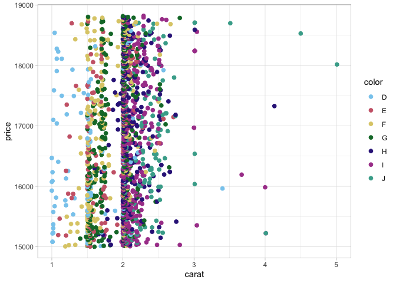

<!-- README.md is generated from README.Rmd. Please edit that file -->

# Colors for all! <a href="https://mtennekes.github.io/cols4all/"></a>


<!-- badges: start --->
[](https://cran.r-project.org/package=cols4all)
[](https://cran.r-project.org/web/checks/check_results_cols4all.html)
[](https://www.r-pkg.org/pkg/cols4all)
<!-- badges: end --->


The **cols4all** is a new R package for selecting color palettes. “Color
for all” refers to our mission that colors should be usable for not just
people with normal color vision, but also for people with color vision
deficiency. Currently, this package contains palettes from several
popular and lesser known color palette series. Own palettes series can
be added as well.

Color palettes are well organized and made consistent with each other.
Moreover, they are scored on several aspects: color-blind-friendliness,
the presence of intense colors (which should be avoided), the overall
aesthetic harmony, and how many different hues are used. Finally, for
each color palette a color for missing values is assigned, which is
especially important for spatial data visualization. Currently we
support several types: *categorical* (qualitative) palettes,
*sequential* palettes, *diverging* palettes, and *bivariate* palettes
(divided into four subtypes).

## Installation

**cols4all** is available on CRAN:

``` r
install.packages("cols4all", dependencies = TRUE)
```

The development version can be installed as follows:

``` r
install.packages("remotes")
remotes::install_github("mtennekes/cols4all", dependencies = TRUE)
```

## Getting started

Load the package:

``` r
library(cols4all)
```

The main tool is a dashboard, which is started with:

``` r
c4a_gui()
```


What types and series are available?

``` r
c4a_types()
#>   type                          description
#> 1  cat                          categorical
#> 2  seq                           sequential
#> 3  div                            diverging
#> 4 bivs  bivariate (sequential x sequential)
#> 5 bivc bivariate (sequential x categorical)
#> 6 bivd   bivariate (sequential x diverging)
#> 7 bivg bivariate (sequential x desaturated)

c4a_series()
#>     series                                         description
#> 1   brewer                                ColorBrewer palettes
#> 2      c4a                  cols4all palettes (in development)
#> 3    carto                          Palettes designed by CARTO
#> 4      hcl  Palettes from the Hue Chroma Luminance color space
#> 5   kovesi                   Palettes designed by Peter Kovesi
#> 6      met Palettes inspired by The Metropolitan Museum of Art
#> 7     misc                              Miscellaneous palettes
#> 8    parks                 Palettes inspired by National Parks
#> 9     poly               Qualitative palettes with many colors
#> 10   scico     Scientific colour map palettes by Fabio Crameri
#> 11 seaborn            Palettes from the Python library Seaborn
#> 12 stevens                Bivariate palettes by Joshua Stevens
#> 13 tableau                        Palettes designed by Tableau
#> 14     tol                       Palettes designed by Paul Tol
#> 15 viridis          Palettes fom the Python library matplotlib
#> 16     wes                   Palettes from Wes Anderson movies
```

How many palettes per type x series?

``` r
c4a_overview()
#>         cat seq div bivs bivc bivd bivg
#> brewer    8  18   9    2    1    1   NA
#> c4a      NA  NA   2    2   NA    2    5
#> carto     6  21   7   NA   NA   NA   NA
#> hcl       9  23  11   NA   NA   NA   NA
#> kovesi   NA  17  13   NA   NA   NA   NA
#> met      33   8  14   NA    1   NA   NA
#> misc      5  NA  NA   NA    3   NA   NA
#> parks    22   5   3   NA   NA   NA   NA
#> poly      9  NA  NA   NA   NA   NA   NA
#> scico    NA  18  14   NA    2   NA    1
#> seaborn   6   4   2   NA   NA   NA   NA
#> stevens  NA  NA  NA    5   NA   NA   NA
#> tableau  29  23  28   NA   NA   NA   NA
#> tol       7   7   3   NA   NA   NA   NA
#> viridis  NA   7   1   NA   NA   NA   NA
#> wes      18  NA   1   NA   NA   NA   NA
```

What palettes are available, e.g diverging from the hcl series?

``` r
# Diverging palettes from the 'hcl' series
c4a_palettes(type = "div", series = "hcl")
#>  [1] "hcl.blue_red1"    "hcl.blue_red2"    "hcl.blue_red3"    "hcl.red_green"   
#>  [5] "hcl.purple_green" "hcl.purple_brown" "hcl.green_brown"  "hcl.blue_yellow2"
#>  [9] "hcl.blue_yellow3" "hcl.green_orange" "hcl.cyan_magenta"
```

Give me the colors!

``` r
# select purple green palette from the hcl series:
c4a("hcl.purple_green", 11)
#>  [1] "#492050" "#82498C" "#B574C2" "#D2A9DB" "#E8D4ED" "#F1F1F1" "#C8E1C9"
#>  [8] "#91C392" "#4E9D4F" "#256C26" "#023903"

# get the associated color for missing values
c4a_na("hcl.purple_green")
#> [1] "#868686"
```

Plot these colors:

``` r
c4a_plot("hcl.purple_green", 11, include.na = TRUE)
```

<!-- -->

## Using cols4all palettes in ggplot2

``` r
library(ggplot2)
data("diamonds")
diam_exp = diamonds[diamonds$price >= 15000, ]

# discrete categorical scale
ggplot(diam_exp, aes(x = carat, y = price, color = color)) +
    geom_point(size = 2) +
    scale_color_discrete_c4a_cat("carto.safe") +
    theme_light()
```

<!-- -->

``` r

# continuous diverging scale
ggplot(diam_exp, aes(x = carat, y = depth, color = price)) +
    geom_point(size = 2) +
    scale_color_continuous_c4a_div("wes.zissou1", mid = mean(diam_exp$price)) +
    theme_light()
```

<!-- -->

## Overview of functions

Main functions:

- `c4a_gui` Dashboard for analyzing the palettes
- `c4a` Get the colors from a palette (`c4a_na` for the associated color
  for missing values)
- `c4a_plot` Plot a color palette

Palette names and properties:

- `c4a_palettes` Get available palette names
- `c4a_series` Get available series names
- `c4a_types` Get implemented types
- `c4a_overview` Get an overview of palettes per series x type.
- `c4a_citation` Show how to cite palettes (with bibtex code).
- `c4a_info` Get information from a palette, such as type and maximum
  number of colors
- `.P` Environment via which palette names can be browsed with
  auto-completion (using `$`)

Importing and exporting palettes:

- `c4a_data` Build color palette data
- `c4a_load` Load color palette data
- `c4a_sysdata_import` Import system data
- `c4a_sysdata_export` Export system data

ggplot2

- `scale_<aesthetic>_<mapping>_c4a_<type>`
  e.g. `scale_color_continuous_c4a_div` Add scale to ggplot2.

## Related R packages

The foundation of this package is another R package:
[**colorspace**](https://colorspace.r-forge.r-project.org/). We use this
package to analyse colors. For this purpose and specifically for color
blind friendliness checks, we also use
[**colorblindcheck**](https://github.com/Nowosad/colorblindcheck).

There are a few other pacakges with a large collection of color
palettes, in particular [**pals**](https://kwstat.github.io/pals/) and
[**paletteer**](https://github.com/EmilHvitfeldt/paletteer). There are a
few features that distinguishes **cols4all** from those packages:

- Color palettes are characterized and analysed. Properties such as
  color blindness, fairness (whether colors stand out about equally),
  and contrast are determined for each palette.

- Bivariate color palettes are available (besides the three main palette
  types: categorical, sequential, and diverging).

- Own color palettes can be loaded and analysed.

- Color for missing values are made explicit.

- Palettes are made consistent with each other to enable comparison. For
  instance, black and white are (by default) removed from categorical
  palettes. Another standard that we adapt to is that all sequential
  palettes go from light to dark and not the other way round.

- There is native support for **ggplot2** and **tmap** (as of the
  upcoming version 4).

- There are a couple of exporting options, including (bibtex) citation.

## Feedback welcome!

- Is everything working as expected?

- Do you miss certain palettes?

- Do you have ideas for improvement how to measure palette properties?

Let us know! (via github issues)

## Bonus: 2568 palettes from **paletteer**

The R package
[**paletteer**](https://github.com/EmilHvitfeldt/paletteer) contains
2568 from 70 other R packages. These have been converted to data for
**cols4all**
[(script)](https://github.com/mtennekes/cols4all/blob/main/build/build_paletteer.R)

These can be loaded and analysed as follows:

``` r
paletteer_data = readRDS(url("https://github.com/mtennekes/cols4all/releases/download/v0.6/paletteer.rds","rb"))
c4a_sysdata_import(paletteer_data)
#> cols4all system data imported successfully
```

Note that we use `c4a_sysdata_import` rather than `c4a_load` because we
want to replace all the palette data to avoid overlap and conflicts with
the palettes already included in **cols4all**.

``` r
c4a_overview()
#>                      cat seq div bivs bivc bivd bivg
#> awtools                4   2  NA   NA   NA   NA   NA
#> basetheme              8  NA  NA   NA   NA   NA   NA
#> beyonce              100  21   9   NA   NA   NA   NA
#> calecopal             40   4   1   NA   NA   NA   NA
#> cartography            2  14  NA   NA   NA   NA   NA
#> colorBlindness         3   2  14   NA   NA   NA   NA
#> colorblindr            2  NA  NA   NA   NA   NA   NA
#> colRoz                50   3   1   NA   NA   NA   NA
#> dichromat              2   2  13   NA   NA   NA   NA
#> DresdenColor          18  NA  NA   NA   NA   NA   NA
#> dutchmasters           6  NA  NA   NA   NA   NA   NA
#> feathers              11  NA  NA   NA   NA   NA   NA
#> fishualize           162  12  NA   NA   NA   NA   NA
#> futurevisions         14   5   1   NA   NA   NA   NA
#> ggpomological          2  NA  NA   NA   NA   NA   NA
#> ggprism               61   4  NA   NA   NA   NA   NA
#> ggsci                 25  19   1   NA   NA   NA   NA
#> ggthemes             100  24  28   NA   NA   NA   NA
#> ggthemes_ptol          1  NA  NA   NA   NA   NA   NA
#> ggthemes_solarized     8  NA  NA   NA   NA   NA   NA
#> ggthemr               18  NA  NA   NA   NA   NA   NA
#> ghibli                27  NA  NA   NA   NA   NA   NA
#> grDevices              5  80  36   NA   NA   NA   NA
#> harrypotter           NA  16  NA   NA   NA   NA   NA
#> impressionist.colors  24  NA  NA   NA   NA   NA   NA
#> IslamicArt            16  NA  NA   NA   NA   NA   NA
#> jcolors               10   3  NA   NA   NA   NA   NA
#> khroma                11  21  20   NA   NA   NA   NA
#> LaCroixColoR          13  NA   8   NA   NA   NA   NA
#> lisa                 121   4   3   NA   NA   NA   NA
#> Manu                  19  NA  NA   NA   NA   NA   NA
#> MapPalettes           NA   2   4   NA   NA   NA   NA
#> MetBrewer             56  NA  NA   NA   NA   NA   NA
#> miscpalettes          16   1  NA   NA   NA   NA   NA
#> musculusColors         7  NA  NA   NA   NA   NA   NA
#> nationalparkcolors    25  NA  NA   NA   NA   NA   NA
#> NatParksPalettes      30  NA  NA   NA   NA   NA   NA
#> nbapalettes          128   1  NA   NA   NA   NA   NA
#> NineteenEightyR        7   3   2   NA   NA   NA   NA
#> nord                  11   3   2   NA   NA   NA   NA
#> ochRe                 15  NA   1   NA   NA   NA   NA
#> oompaBase             NA   5   3   NA   NA   NA   NA
#> palettesForR          42   4   2   NA   NA   NA   NA
#> palettetown          389  NA  NA   NA   NA   NA   NA
#> palr                  NA   4  NA   NA   NA   NA   NA
#> pals                   8  59  18   NA   NA   NA   NA
#> peRReo                21  NA  NA   NA   NA   NA   NA
#> PNWColors              4   7   3   NA   NA   NA   NA
#> Polychrome             8  NA  NA   NA   NA   NA   NA
#> rcartocolor            6  21   7   NA   NA   NA   NA
#> RColorBrewer           8  19   8   NA   NA   NA   NA
#> Redmonder             24  10   7   NA   NA   NA   NA
#> rockthemes            21  NA  NA   NA   NA   NA   NA
#> RSkittleBrewer         5  NA  NA   NA   NA   NA   NA
#> rtist                 15  NA  NA   NA   NA   NA   NA
#> scico                 NA  21  14   NA   NA   NA   NA
#> severance              7  NA  NA   NA   NA   NA   NA
#> soilpalettes           7   7  NA   NA   NA   NA   NA
#> suffrager              6  NA  NA   NA   NA   NA   NA
#> tayloRswift            9   1  NA   NA   NA   NA   NA
#> tidyquant              3  NA  NA   NA   NA   NA   NA
#> trekcolors            23   8   4   NA   NA   NA   NA
#> tvthemes              58  NA  NA   NA   NA   NA   NA
#> unikn                  5   8   3   NA   NA   NA   NA
#> vapeplot               8  NA  NA   NA   NA   NA   NA
#> vapoRwave             11   2   1   NA   NA   NA   NA
#> viridis               NA   8  NA   NA   NA   NA   NA
#> werpals               17   1  NA   NA   NA   NA   NA
#> wesanderson           19  NA  NA   NA   NA   NA   NA
#> yarrr                 21  NA  NA   NA   NA   NA   NA
```

``` r
c4a_gui()
```


Note that this dashboard is not particularly fast (so grab a coffee:-))
