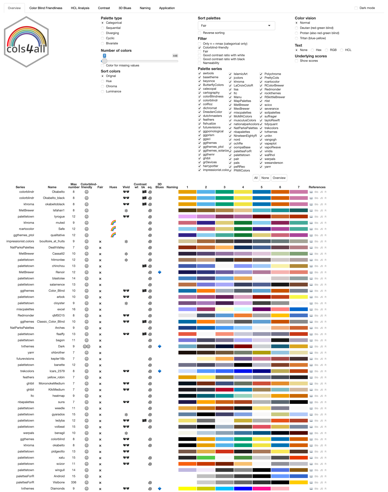
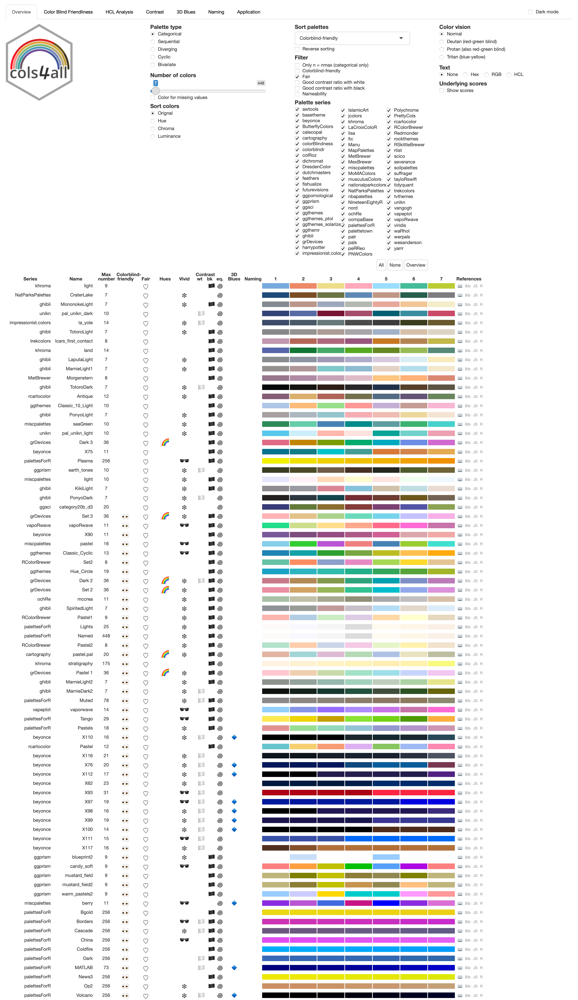

```{r, include = FALSE}
knitr::opts_chunk$set(
  collapse = TRUE,
  fig.width=6, 
  fig.height=3,
  comment = "#>"
)
hook_output <- knitr::knit_hooks$get("output")
knitr::knit_hooks$set(output = function(x, options) {
   lines <- options$output.lines
   if (is.null(lines)) {
     return(hook_output(x, options))  # pass to default hook
   }
   x <- unlist(strsplit(x, "\n"))
   more <- "..."
   if (length(lines)==1) {        # first n lines
     if (length(x) > lines) {
       # truncate the output, but add ....
       x <- c(head(x, lines), more)
     }
   } else {
     x <- c(more, x[lines], more)
   }
   # paste these lines together
   x <- paste(c(x, ""), collapse = "\n")
   hook_output(x, options)
 })

```

```{r setup, include=FALSE}
library(cols4all)
```


## Introduction

The most extensive collection of color palettes in R is the package \texttt{paletteer} @paletteer with big credits to the author Emil Hvitfeldt. Let's load these palettes into \texttt{cols4all}.

## Loading the paletteer palettes
The prepared system data can be loaded as follows:

```{r}
paletteer = readRDS(gzcon(url("https://mtennekes.github.io/cols4all/paletteer.rds")))
c4a_sysdata_import(paletteer)
```

Note that this system data import will replace the default cols4all palettes. This is convenient because almost all cols4all palettes are also contained in **paletteer**. The only exceptions are the cols4all palette series `"powerbi"` and `"cols4all"`.

An overview of the number of available palettes:

```{r}
(m <- c4a_overview(return.matrix = TRUE))
```

There are in total `r sum(m)` palettes, and by palette type:

```{r}
colSums(m)
```

## Exploring the palettes

Now we can start the interactive tool:

```{r eval=FALSE}
c4a_gui()
```

First we will see all categorical palettes of length 7, sorted by name. When we filter on color blind friendliness and sort by fairness (a measure that indicated whether all colors stand out about equally) we get this table:


```{r cbf,fig.cap="Colorblind friendly categorical palettes of 7 colors, sorted by fairness"}
#| fig.alt = "Fair categorical palettes of 7 colors, filtered by colorblind-friendliness",
#| out.width = 800,
#| echo = FALSE,


```

The other way round, when we filter on fair and sort by colorblind-friendliness we get this table:

```{r fair,fig.cap="Fair categorical palettes of 7 colors, sorted by colorblind-friendliness"}
#| fig.alt = "Fair categorical palettes of 7 colors, filtered by colorblind-friendliness",
#| out.width = 800,
#| echo = FALSE,


```

Observe that there are no color palettes of length 7 that are both color-blind friendly and fair. The good news is that cols4all contains a few new preliminary palettes that meet both criteria. See [strategies for palette design](paper.html#strategies-for-palette-design).

