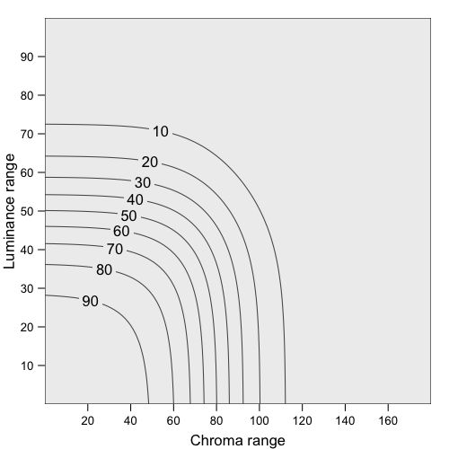
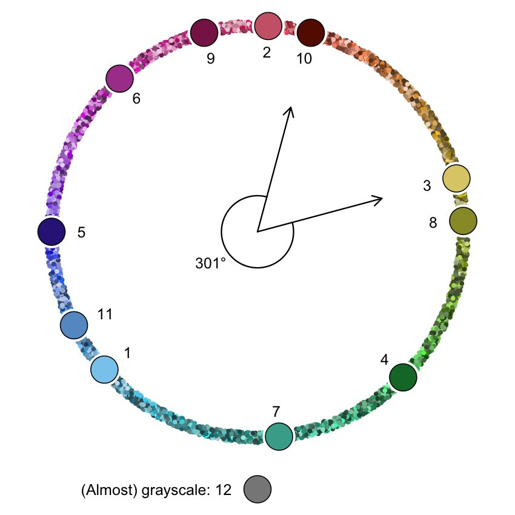
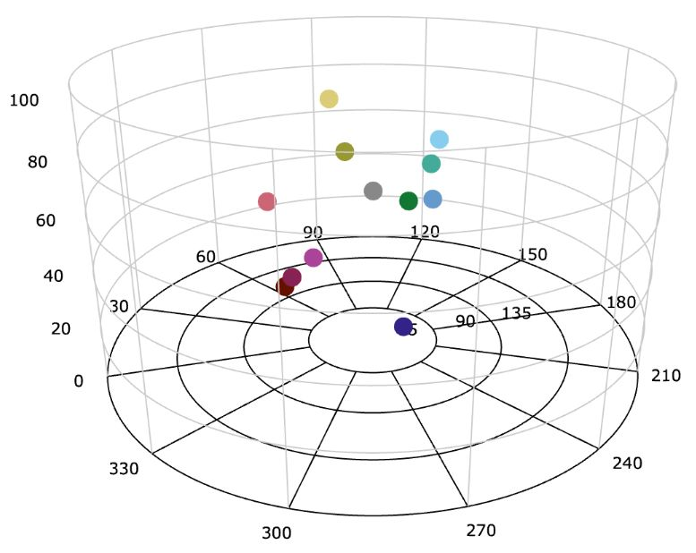
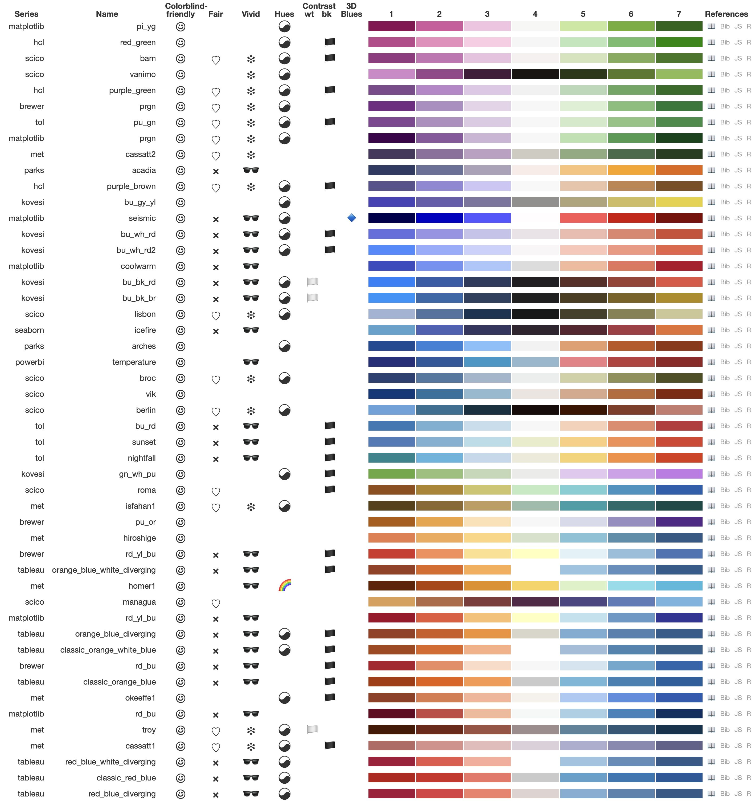
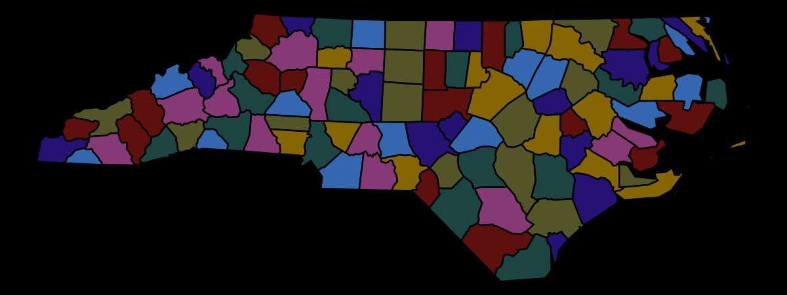
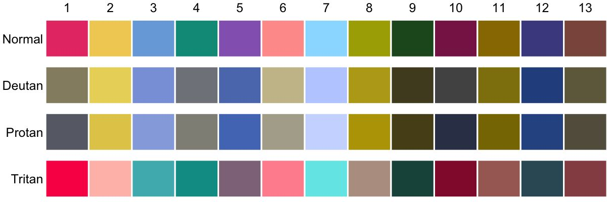

```{r, include = FALSE}
knitr::opts_chunk$set(
  collapse = TRUE,
  fig.width=6, 
  fig.height=3,
  comment = "#>"
)
hook_output <- knitr::knit_hooks$get("output")
knitr::knit_hooks$set(output = function(x, options) {
   lines <- options$output.lines
   if (is.null(lines)) {
     return(hook_output(x, options))  # pass to default hook
   }
   x <- unlist(strsplit(x, "\n"))
   more <- "..."
   if (length(lines)==1) {        # first n lines
     if (length(x) > lines) {
       # truncate the output, but add ....
       x <- c(head(x, lines), more)
     }
   } else {
     x <- c(more, x[lines], more)
   }
   # paste these lines together
   x <- paste(c(x, ""), collapse = "\n")
   hook_output(x, options)
 })

```

```{r setup, include=FALSE}
library(cols4all)
```


```{r teaser,fig.cap="cols4all Main table"}
#| fig.alt = "cols4all Main table",
#| out.width = 700,
#| echo = FALSE

knitr::include_graphics("cols4all2.jpg")
```

## Introduction


Effective data visualization relies heavily on well-chosen color palettes to highlight patterns and convey information clearly @midway20.  With the abundance of available color palettes, ranging from those derived from perceptually uniform color spaces like HCL [@hcl;@scico;@matplotlib] to those designed for color blindness accessibility [@misc.okabe;@tol;@matplotlib] or inspired by art [@met;@wes] and nature @parks, selecting the optimal palette for a specific visualization task can be challenging.

This challenge is further compounded by the need to consider accessibility for individuals with color vision deficiency, who comprise an estimated 8\% of males and 0.5\% of females globally @birch2012.  Accessibility guidelines, such as WCAG 2.2 @wcag22, recommend minimum contrast ratios between colors to ensure readability. Ensuring that visualizations are interpretable by everyone, regardless of their color vision capabilities, is essential for effective communication.

To address these challenges, we introduce \texttt{cols4all}, an open-source software tool for analyzing and comparing color palettes. Developed as a package for the R programming language @c4a that features an interactive dashboard tool, \texttt{cols4all} provides a comprehensive set of features to evaluate palettes based on various criteria, including color-blind friendliness, contrast, and a novel fairness metric. Fairness evaluates whether all colors in a palette stand out equally. This is particularly important for categorical palettes to prevent visual bias and ensure that no single category dominates the visualization.

Recognizing that these properties can involve trade-offs, \texttt{cols4all} empowers users to make informed decisions based on their specific needs and priorities. The tool's interactive nature allows users to explore and compare palettes, weighing different factors to select the most suitable option for their visualization task.

With \texttt{cols4all}, we aim to engage the information visualization community in color perception research and promote the development of more accessible and effective visualizations. By providing this open-source tool, we hope to reach researchers, designers, and practitioners alike, encouraging the sharing of knowledge and best practices in color palette selection and design.


## Related literature

Visualization software and tools increasingly incorporate features for color palette selection, offering predefined palettes and interactive previews.  ColorBrewer @brewer provides a limited but highly popular set of palettes and includes a colorblind-safe checkbox to aid in palette selection. Commercial platforms like Tableau @tableau and Microsoft Power BI @powerbi offer more extensive built-in palettes. Platforms like Adobe Color @adobe and Color Hunt @colorhunt support community-driven exploration and creation.  However, these tools primarily focus on quick exploration rather than in-depth analysis and comparison of palette properties.

Dedicated tools address this gap by providing more comprehensive analytical capabilities. CCC-Tool @CCCtool and Colorgorical @Colorgorical allow for palette generation based on user preferences, catering to experienced users. In contrast, \texttt{cols4all} prioritizes analysis and comparison over generation, empowering users to make informed choices based on quantitative and qualitative insights derived from objective metrics and visualizations.

Recent research has explored advanced techniques for color palette recommendation. Deep learning approaches show promise for automated palette selection @yuan22, but often lack the transparency and interpretability of \texttt{cols4all}'s user-centric approach. Similarly, McNutt et al. @mcnutt2024 introduced a visualization linter for automated color palette checking, which is valuable for identifying potential issues but differs from \texttt{cols4all}'s focus on interactive exploration and comparison.

Furthermore, \texttt{cols4all} deliberately avoids linking colors or palettes to specific emotions, recognizing the cultural and temporal variability of color associations @elliot2014, schloss2011. By focusing on objective metrics rather than subjective interpretations, \texttt{cols4all} fosters informed decision-making without relying on potentially culturally biased associations.


## Preliminaries


### Color vision


Humans typically perceive color through three types of cone cells. These cones measure the color spectrum in three different areas: short, medium, and long wavelengths. The combination of these three cone types leads to a color percept (a perceived color).

People with color vision deficiency lack (at least) one type of cone. For the three types of color blindness, \textit{deuteranopia}, \textit{protanopia}, and \textit{tritanopia}, the missing cones are those mainly sensitive to medium (green), long (red), and short (blue) wavelengths, respectively. Color perception for these individuals is based on the two remaining cone types. As a result, people with deuteranopia and protanopia have difficulty distinguishing green and red, whereas people with tritanopia can hardly distinguish blue from yellow @neitz90. 

People can also be partially color blind. However, to avoid excessive complexity in the analysis, we do not take the severity level into account. For brevity, individuals with deuteranopia, protanopia, and tritanopia will be referred to as \textit{deutans}, \textit{protans}, and \textit{tritans}, respectively.


### Contrast ratio


The contrast ratio measures the difference in brightness between foreground and background colors. It is defined as:

\begin{equation}
CR(i,j) = \frac{(Y_i + \alpha)}{(Y_j + \alpha)}
(\#eq:cr)
\end{equation}

\noindent where $i$ and $j$ represent two colors, with $i$ being the lighter one, and $Y_i$ and $Y_j$ are their relative luminance values, ranging from 0 to 1. The parameter $\alpha = 0.05$ is an offset used to compensate for contrast ratios that occur when $Y_j$ is (close to) 0. With this $\alpha$ value, the contrast ratio ranges from 1:1 to 21:1.

The WCAG 2.2 guidelines for text readability are as follows @wcag22:

\begin{enumerate}
\item Large text (18 point) requires a contrast ratio of at least 3:1 (AA) and 4.5:1 (AAA).
\item Normal text (14 point) requires a contrast ratio of at least 4.5:1 (AA) and 7:1 (AAA).
\end{enumerate}

WCAG 2.2 level AA requires a minimum contrast ratio of 3:1 for informational non-text elements, both against the background and any adjacent colors @wcag22.

### HCL color space

This work adopts the Hue-Chroma-Luminance (HCL) color space, a cylindrical transformation of the CIELUV color space. This color space, also used by [@hcl;@colorspace;@ihaka2003], has three dimensions: \textit{hue} ($H$), ranging from 0 to 360 degrees; \textit{chroma} ($C$), ranging from 0 (grayscale) to a maximum that depends on both hue and luminance; and \textit{luminance} ($L$), ranging from 0 (black) to 100 (white).

### Color distance

To measure the perceived distance between two colors, we use the \emph{Delta E 2000} metric @sharma2005, denoted by $\Delta E(i,j)$.

The interpretation of Delta E values depends on several factors, most importantly the application. We apply the following rule of thumb\footnote{Based on: Zachary Schuessler, "Delta E 101," accessed 2024-09-30, \url{http://zschuessler.github.io/DeltaE/learn/}.}:

Table: (\#tab:deltae) Delta E interpretation

|Delta E Range|Perceptibility|
|:---|:---|
|0-1|Not perceptible at all|
|1-2|Perceptible through close observation|
|2-5|Noticeable difference|
|5-10|Strong color difference|
|10-15|Substantial color difference|
|15+|Vastly different colors|

To measure color distances as perceived by people with color vision deficiency, we apply the Delta E metric in simulations for deuteranopia, protanopia, and tritanopia @machado2009,colorblindcheck. These metrics are denoted by $\Delta E^{\mbox{deutan}}(i,j)$, $\Delta E^{\mbox{protan}}(i,j)$, and $\Delta E^{\mbox{tritan}}(i,j)$, respectively.


## Tool description

We introduce a tool, called \texttt{cols4all}, that can be used to analyse and compare color palettes. It is written as a package for the R programming language @r. 

The cols4all package has an on-going development and driven by the active community of statisticians and data scientists that use R. The color palettes can easily be used in any other R package, and has native integration with the popular visualization package ggplot2 @ggplot2. Via the GUI, these palettes can also be copied to the clipboard and used anywhere else.

The tool is intended for data visualization designers to select appropriate color palettes for their data visualizations. Another use case for designers is to test their own (corporate) palettes, and to compare them against other existing palettes. The tool may also be useful for other users, in particular graphic designers and web designers. User studies are required to ensure that the design of the interface is effective, efficient, and easy to use.

### Organisation of palettes

This work focuses exclusively on \textbf{discrete} color palettes. Continuous color palettes can be loaded and analysed in \texttt{cols4all} as well, but under the hood they are discretized in a sufficient number of classes. Conversely, interpolation (linear or spline) in a color space (RGB or CIELab) can transform any discrete palette into a continuous color ramp.


Palettes are organised by functional type. We distinguish the following types:

*   **Categorical:** Colors from a categorical (also known as qualitative) palette are typically very distinct, especially in hue and are unordered. These palettes are employed to represent categorical data without a natural order, such as economic sectors.
*   **Sequential:** A sequential palette consists of a gradient of colors, which are used to represent data that follow a natural order or progression, such as age.
*   **Diverging:** A diverging palette also consists of a gradient of colors, but with a clear midpoint. Consequently, these palettes encode data that have a clear neutral value, for instance stock price changes or Likert scale responses.
*   **Cyclical:** A cyclic palette consists of a gradient of colors that can be repeated seamlessly, so the first and last color should be identical. Although used rarely compared to the types mentioned above, they can be useful for several applications, such as encoding biological rhythms and cyclic economic indicators, such as business cycles.
*   **Bivariate:** A bivariate palette is a two-dimensional color table that is used to encode bivariate data, for instance population density and income, or bivaraite socioeconomic indicators. We distinguish four subtypes where the first dimension, represented by the rows, is equal to sequential color scale. For these subtypes, the second dimension (columns) is represented as sequential, categorical, diverging, and a desaturated scale respectively.


```{r expals1, fig.cap = "Example of palette type: categorical"}
#| fig.alt = "Example of palette type: categorical",
#| out.width = 400,
#| echo = FALSE

knitr::include_graphics("ex_cat.jpg")
```

```{r expals2, fig.cap = "Example of palette type: sequential"}
#| fig.alt = "Example of palette type: sequential",
#| out.width = 400,
#| echo = FALSE

knitr::include_graphics("ex_seq.jpg")
```

```{r expals3, fig.cap = "Example of palette type: diverging"}
#| fig.alt = "Example of palette type: diverging",
#| out.width = 400,
#| echo = FALSE

knitr::include_graphics("ex_div.jpg")
```

```{r expals4, fig.cap = "Example of palette type: cyclic"}
#| fig.alt = "Example of palette type: cyclic",
#| out.width = 400,
#| echo = FALSE

knitr::include_graphics("ex_cyc.jpg")
```

```{r expals5, fig.cap = "Example of palette type: bivariate (seq x seq)"}
#| fig.alt = "Example of palette type: bivariate (seq x seq)",
#| out.width = 200,
#| echo = FALSE

knitr::include_graphics("ex_bivs.jpg")
```

```{r expals6, fig.cap = "Example of palette type: bivariate (seq x cat)"}
#| fig.alt = "Example of palette type: bivariate (seq x cat)",
#| out.width = 200,
#| echo = FALSE

knitr::include_graphics("ex_bivc.jpg")
```

```{r expals7, fig.cap = "Example of palette type: bivariate (seq x div)"}
#| fig.alt = "Example of palette type: bivariate (seq x div)",
#| out.width = 200,
#| echo = FALSE

knitr::include_graphics("ex_bivd.jpg")
```

```{r expals8, fig.cap = "Example of palette type: bivariate (seq x desaturated)"}
#| fig.alt = "Example of palette type: bivariate (seq x desaturated)",
#| out.width = 200,
#| echo = FALSE

knitr::include_graphics("ex_bivg.jpg")
```


Examples of each of these palette types are provided in Figures \@ref(fig:expals1) to \@ref(fig:expals8). This list of palette types is not exhaustive; for instance also palettes for tree-structured data have been designed @tennekes14. Because these kind of palette types are special and often one of a kind, they are not (yet) included in \texttt{cols4all}.


Palettes are also arranged by series, by which we mean either the source (e.g. \texttt{brewer} stands for ColorBrewer @brewer) or group of similar palettes (e.g. \texttt{poly} includes categorical palettes with many colors). An overview of the palettes that are included in cols4all is provided in Table \@ref(tab:overview).

Table: (\#tab:overview) Overview of the palettes series

|series     |description                                         | cat| seq| div| cyc| bivs| bivc| bivd| bivg|
|:----------|:---------------------------------------------------|---:|---:|---:|---:|----:|----:|----:|----:|
|brewer     |ColorBrewer palettes                                |   8|  18|   9|   0|    2|    2|    1|    0|
|carto      |Palettes designed by CARTO                          |   6|  21|   7|   0|    0|    0|    0|    0|
|cols4all   |cols4all palettes (in development)                  |  14|   0|   2|   0|    2|    0|    2|    5|
|hcl        |Palettes from the Hue Chroma Luminance color space  |   9|  23|  11|   6|    0|    0|    0|    0|
|kovesi     |Palettes designed by Peter Kovesi                   |   0|  28|  14|   8|    0|    0|    0|    0|
|matplotlib |Palettes from the Python library matplotlib         |   0|  51|  12|   3|    0|    0|    0|    0|
|met        |Palettes inspired by The Metropolitan Museum of Art |  33|   8|  14|   0|    0|    1|    0|    0|
|misc       |Miscellaneous palettes                              |   5|   0|   0|   0|    0|    3|    0|    0|
|parks      |Palettes inspired by National Parks                 |  22|   5|   3|   0|    0|    0|    0|    0|
|poly       |Qualitative palettes with many colors               |   9|   0|   0|   0|    0|    0|    0|    0|
|powerbi    |Palettes from Microsoft Power BI                    |  19|   1|   4|   0|    0|    0|    0|    0|
|scico      |Scientific colour maps by Fabio Crameri             |  21|  21|  10|   5|    0|    2|    0|    1|
|seaborn    |Palettes from the Python library Seaborn            |   6|   4|   2|   0|    0|    0|    0|    0|
|stevens    |Bivariate palettes by Joshua Stevens                |   0|   0|   0|   0|    5|    0|    0|    0|
|tableau    |Palettes designed by Tableau                        |  29|  23|  28|   0|    0|    3|    0|    0|
|tol        |Palettes designed by Paul Tol                       |   8|   8|   4|   0|    0|    0|    0|    0|
|wes        |Palettes from Wes Anderson movies                   |  23|   0|   1|   0|    0|    0|    0|    0|


Some categorical color palettes have included black or white, e.g. \texttt{misc.okabe} @misc.okabe. Since these colors are typically used for background or annotations only, not just for those palettes but for any categorical palette, we removed black and white from all categorical palettes. However, we took both black and white into account for certain parts of the analysis, for instance regarding contrast ratio.

Exploratory data analysis often deals with analysis and visualisation of missing values @vim,song21. Therefore, we assigned a special color for missing values for each palette. The palette series by Paul Tol @tol already contains dedicated colors for missing values. For the other palettes, we use simple heuristics to obtain a suitable color, which is a greyscale color that is distinguishable from the other palette colors not only by people with normal color vision but also by colorblind people.

Users are able to load, analyse, and compare other palettes as well @c4a. The palette names in the tool are formatted in snake case, with the series name put in front separated with a dot. E.g. the Color Blind from Tableau @tableau is called \texttt{tableau.color\_blind}.


### Properties

#### Color blind friendliness

Let the minimal perceived distance of two colors $i$ and $j$ colors by defined as

\begin{equation}
d(i,j) = \min \left( \substack{
\Delta E(i,j), \\
\Delta E^{\mbox{deutan}}(i,j), \\
\Delta E^{\mbox{protan}}(i,j), \\
\Delta E^{\mbox{tritan}}(i,j)
} \right)
\end{equation}

This metric takes all four groups (people with normal color vision and each of the color blindness groups) into account. In case two color can easily be distinguished by three of these groups, but not so well by the fourth, than $d(i,j)$ will be low.

For $d(i,j)$ we use the same interpretation as provided in Table \@ref(tab:deltae), so of the group that has the most trouble with distinguishing the colors.


For \textbf{categorical} palettes we simply use the minimum distance over any two palette colors $i$ and $j$:

\begin{equation}\label{Minimum distance}
\mbox{min_dist}(S) = \min_{i,j \in S} d(i,j)
\end{equation}

\noindent where $S$ is the set of colors that form a certain color palette.

Higher values are generally preferable. To make decision making easier, we discretize this metric into three point Likert scale, with additional fourth $++$ category: 

\begin{equation}
\begin{aligned}
&- && 0 \le \mbox{min_dist}(S) < 2 \\
&\circ && 2 \le \mbox{min_dist}(S) < 10 \\
&+ && 10 \le \mbox{min_dist}(S) < 15 \\
&++ && \mbox{min_dist}(S) \ge 15
\end{aligned}
\end{equation}

In the main overview table (Figure \@ref(fig:teaser)), the categories are represented by symbols: side eyes for $−$, a smiley for $+$, and a double smiley for $++$.

While the default threshold values are based on the Delta~E interpretation provided above, users can adjust them within cols4all. The $+$ category can be interpreted as color blind friendly, the $-$ as not color blind friendly, and the $\circ$ as in between. For categorical palettes we added the $++$ to highlight palettes for which the colors can be distinguished with ease by people with color vision deficiency. This is especially useful for applications in which the colored objects are small, e.g. lines and points.

We use the same metric $\mbox{min\_dist}(S)$ for \textbf{sequential} palettes. Because color distances are smaller for gradient color ramps we use different default threshold values, namely 1 and 5 and make not use of an additional fourth category.

In addition, it is important that the order of the colors is correctly perceived. If three colors $i$, $j$, and $k$ are next to each other in a palette, then both $d(i,j)$ and $d(j,k)$ should be less than $d(i,k$. 
Hence, we derive the following metric, that we call triangle inequality difference score:

\begin{equation}
\mbox{tri_ineq}(S) = \min_{\{i,j,k\} \in S} \left( d(i,k) - \max \left( d(i,j), d(j,k) \right) \right)
\end{equation}

where we use $\{\}$ to denote colors that are next to each other.

Higher values are generally preferable, with 0 as a clear threshold. Values below 0 indicate that the perceived color distance between $i$ and $k$ is less than that between either $i$ and $j$ or $j$ and $k$.


\begin{equation}
\begin{aligned}
&- && 0 \le \mbox{min_dist}(S) < 2 && \mbox{OR} && \mbox{tri_ineq}(S) < 0\\
&+ && \mbox{min_dist}(S) \ge 5 && \mbox{AND} && \mbox{tri_ineq}(S) \ge 2\\
&\circ && \mbox{otherwise} && && \\
\end{aligned}
\end{equation}

These threshold values can be adjusted inside cols4all if needed.

For \textbf{diverging} palettes we use three metrics to derive a color blind friendliness property. Instead of min\_dist, two metrics are introduced, namely min\_step that is defined as the minimum distance of two neighbouring colors, and inter\_wing\_dist, the distance between the two wings of the palette.

\begin{equation}
\mbox{min_step}(S) = \min_{\{i,j\} \in S} d(i,j)
\end{equation}

The inter wing distance is the minimum distance between any palette color $i$ (except the middle color) and its opposite wing:

\begin{equation}
\mbox{inter_wing_dist}(S) = \min_{i \in S'} d(i,R_{-i})
\end{equation}

\noindent where $S'$ is equal to the palette $S$ without middle color (in case the number of colors is odd). We denote $R_{-i}$ as the colors of the wing opposite to color $i$ in the form of a color ramp. A color ramp is needed to make sure the distance between $i$ and the colors from the other wing cannot be large just because of the luminance (most diverging palettes diverge in luminance with a hue for each wing).

For the \textbf{cyclic} palettes we use exactly the same definition of color blind friendliness as \textbf{sequential} palettes, with the addition that the first and last colors should be identical.

The \textbf{bivariate} color palettes are analysed using a combination of one of the definitions above. For a bivaraite sequential x sequential (Figure \@ref(fig:expals5)), three sequential palettes are derived: the two marginal ones (in the figure, the top row and the left hand side column) and the diagonal (in the figure from top left to bottom right). For each pair of sequential palettes, an odd numbered diverging palette is constructed, each with the top left color as the middle color. Subsequently the color blind friendliness scores for diverging color palettes (as described above) is computed, and the minimal score is used. A similar approach is used for the other three bivariate color palette types @c4a.

Figure \@ref(fig:cbfokabe) shows how users can analyse color blind friendliness in \texttt{cols4all}.

On the top left the CIE xyY space clipped to sRGB gamut is shown with hue lines diverging from the defined white point (CIE standard illuminant D65). The bottom left shows the same plot, but using colors simulated for deutans, with confusion lines @judd43.

In the middle column two similarity matrices are shown, above for people with normal color vision, below for deutans. The big dot indicates there is a minor issue with pink and grey. This is illustrated in the maps in the right hand side column.


#### Fairness

We say that a color palette is fair if all colors stand out about equally. 

For categorical palettes this property ensures visual balance in data visualisations, preventing any single category from dominating, which can obscure other categories or create misleading impressions, unless deliberate highlighting is employed.

This is quantified using the luminance and chroma ranges of the palette colors:

\begin{equation}
\Delta L^{\mbox{max}}(S) = \max_{i \in S} L_i - \min_{j \in S} L_j
\end{equation}

\begin{equation}
\Delta C^{\mbox{max}}(S) = \max_{i \in S} C_i - \min_{j \in S} C_j
\end{equation}

It is important to note that a color's luminance alone does not determine its salience against the background; the background luminance also plays a crucial role. This is exactly where the contrast ratio \@ref(eq:cr) comes into play. However, the smaller the luminance range of the colors, the smaller the contrast ratios of each of those colors with the background color, irrespective of the background color and its luminace itself.

For chroma this is a different story; the higher the chroma, the more that color will stand out, especilly because background colors are generally unchromatic.

Unlike accessibility properties, there are no hard threshold values about what is fair and what not. Therfore, we apply logit transformations for both $\Delta L^{\mbox{max}}$ and $\Delta C^{\mbox{max}}$, normalise and multiply them. The result of the derived fairness score is shown in Figure \@ref(fig:fairness). The scores range from 0 to 100 (fairest). The parameters of those logit transformations, resulting in the shown contour lines, can be adjusted within cols4all @c4a.

To aid decision making a palette is called fair if the fairness score is at least 75, and unfair if it is below 25. This is indicated in the main overview table of cols4all (see Figure \@ref(fig:teaser)) with a heart symbol and a cross respectively.


```{r fairness, fig.cap = "Fairness scores"}
#| fig.alt = "Fairness scores",
#| out.width = 300,
#| echo = FALSE


```


For the other palette types we only take the chroma range into account, because luminance is usually used to form the gradient of colors.


#### Vividness

Another property that is useful for data visualisation is how vivid the palette colors are.

Prolonged exposure to highly saturated colors can induce visual fatigue @cakir1980. Therefore, low saturated (pastel) colors are generally recommended for space-filling visualisations such as choropleths and treemaps @ware2021.

\begin{equation}
C^{\mbox{max}}(S) = \max_{i \in S} C_i
\end{equation}

For decision making purposes, we discretize this metric using default threshold values of 100 and 70. In the main overview table (Figure \@ref(fig:teaser)), these classes are shown with a pair of sunglasses (for $C^{\mbox{max}}(S) >= 100$) and an asterisk (for $C^{\mbox{max}}(S) < 70$).

#### Hues

Analyzing the distribution of hues within a palette is crucial for several reasons. Categorical palettes with an even distribution of hues are often aesthetically preferred to those with uneven distributions.

For other palettes types, the distribution of hues is even more important, because it directly relates to color blind friendliness. Rainbow like sequential or diverging palettes, e.g. that use a wide range of hue values, are typically not color blind friendly.

To facilitate color palette analysis and comparison regarding the distribution of hues, we introduce a metric called hue width, which is defined as the total width (angle) of all hues of the palette colors. This can be computed by 360 minus the largest hue gap:

\begin{equation}
H^{\mbox{width}}(S) = 360 - \max_{\{i,j\} \in S} H_i-H_j
\end{equation}

Because the maximum value for a palette of length $n$ is $360 - 360/n$, which occurs when the hues are spaced evenly, a score between 0 and 100 can be derived which we call hue spread:

\begin{equation}
H^{\mbox{spread}}(S) = \frac{H^{\mbox{width}}(S)}{360 - 360/n} * 100
\end{equation}

In the overview table (Figure \@ref(fig:teaser) categorical palettes get a rainbow symbol when the hue spread is above the default threshold value of 90.

For sequential palettes we use the hue width to classify the hues. Palettes for which the hue width is less than 15 are labeled as "single hue" in the overview table indicated with a pencil symbol. Those palettes are generally recommended because of the relative low visual bias @ware2021. Palettes with a hue width above the default threshold value of 180 are labeled as rainbow palette. Note that this specification is different than for categorical palettes, due to the nature of these palette types.

For diverging palettes, we calculate the hue widths for both wings. If at least one of those hue widths is above 90, the palette is labeled as rainbow palette (with a rainbow symbol in the overview table), and if both hue widths score below 20, it is classified as double hue, shown in the overview table with a yin-yang symbol.


```{r necklace, fig.cap = "Hue necklace with the hue width for carto.safe"}
#| fig.alt = "Hue necklace with the hue width for carto.safe",
#| out.width = 400,
#| echo = FALSE


```


Color blind friendliness can be analysed with the next tab of the tool. Figure \@ref(fig:cbfokabe) shows a part of this tab.

On the top left the CIE xyY space clipped to sRGB gamut is shown with hue lines diverging from the defined white point (CIE standard illuminant D65). The bottom left shows the same plot, but using colors simulated for deutans, with confusion lines @judd43.

In the middle column two similarity matrices are shown, above for people with normal color vision, below for deutans. The big dot indicates there is a minor issue with pink and grey. This is illustrated in the maps in the right hand side column.


```{r cbfokabe, fig.cap = "Color blind friendliness analysis plots for the palette misc.okabe"}
#| fig.alt = "Color blind friendliness analysis plots for the palette misc.okabe",
#| out.width = 700,
#| echo = FALSE

knitr::include_graphics("cbf_okabe.jpg")
```


#### Contrast

Since white and black are frequently used for backgrounds or text, properties are included to assess whether palette colors have sufficient contrast against them.

\begin{equation}
\mbox{CR\_white}(S) = \min_{i \in S}\mbox{CR}(i, \mbox{white})
\end{equation}

\begin{equation}
\mbox{CR\_black}(S) = \min_{i \in S}\mbox{CR}(i, \mbox{black})
\end{equation}

If all colors have sufficient contrast with white, which is 3 according to the WCAG guideline, then $\mbox{CR\_white}(S)\geq 3$ and a white flag will be shown in the overview table (Figure \@ref(fig:teaser). For the contrast ratio with black, a black flag will be shown.

Figure \@ref(fig:contrast) shows a bar chart of the contrast ratio values of the palette~\texttt{powerbi.default} against white. The horizontal lines correspond to the WCAG threshold values; in this example, only yellow does not meet the criterion of 3.


```{r contrast, fig.cap = "Contrast ratio of powerbi.default against white"}
#| fig.alt = "Contrast ratio of powerbi.default against white",
#| out.width = 700,
#| echo = FALSE

knitr::include_graphics("contrast_powerbi_default.jpg")
```


The contrast ratio between two colors is not only useful to check accessibility, but also to warn for unwanted visual illusions. Two colors are called equiluminant if they have similar luminance values, so resulting in a contrast ratio close to 1.

Several visual illusions could appear at equiluminance, such as that the eye has trouble to separate neighbouring objects, even though they use totally different colors in terms of hue @bach. This is illustrated in the map shown in Figure \@ref(fig:equi)(a) where two colors of the palette \texttt{hcl.set3} are used.


```{r equi, fig.cap = "Equiliminant colors from the palette hcl.set3"}
#| fig.alt = "Equiliminant colors from the palette hcl.set3",
#| out.width = 700,
#| echo = FALSE

knitr::include_graphics(c("equi1.jpg", "equi2.jpg"))
```


Therefore, we compute the minimal contrast ratio between palette colors:

\begin{equation}
\mbox{CR\_within}(S) = \min_{i,j \in S}\mbox{CR}(i, j)
\end{equation}

When this value is below the default threshold value of 1.2, a spiral symbol is shown in the overview table \@ref(fig:teaser).


#### 3D Blues

A visual illusion called chromostereopsis occurs where two colors are perceived in different depth planes @brewster1844. This illusion, most prominent with red and blue against a black background, can create a perception of depth or displacement.

Figure \@ref(fig:3dblues) illustrates this illusion with a categorical map of the red and blue colors from \texttt{seaborn.bright}.

```{r 3dblues, fig.cap = "Chromostereopsis caused by two palette colors from seaborn.bright"}
#| fig.alt = "Chromostereopsis caused by two palette colors from seaborn.bright",
#| out.width = 700,
#| echo = FALSE

knitr::include_graphics("3Dblues_map.jpg")
```


To warn for this possible visual illusion, which especially occurs against a dark background, an blue diamond symbol is shown in the overview table.

#### Naming

Color naming significantly influences our perception and communication of color, impacting how we understand and interpret visual information. The ability to accurately name colors is particularly important in data visualization, where clear communication is essential @reda21. However, color naming is inherently subject to cultural variations @kim19, with differences observed not only between distinct cultural regions but also among neighboring countries. For instance, while Dutch uses "paars" and "roze" to describe shades of purple and pink, German employs "Violet", "Lila," "Pink", and "Rosa", highlighting the nuances in color terminology even within geographically close regions. This cultural variability poses a challenge for developing universally applicable color naming systems in data visualization.

In cols4all we derived a property called nameability that informs users whether palette colors are easy to name.

To accomplish this, we explore the match between the palette colors and a basic, commonly used, set of color names. By default we use the English names of the 11 colors identified by @boynton89: green, blue, purple, pink, yellow, brown, orange, red, white, grey, and black.

Let us denote the common color name set as $Q$. We say that the colors of a palette are easy to name if and only if:

\begin{enumerate}
\item Each palette color is almost always named $q \in Q$ by people with normal color vision.
\item Each color name $q \in Q$ is used at most for one palette color. 
\end{enumerate}

The naming match between the palette colors and the common color names is illustrated in Figure \@ref(fig:name), where the first seven colors from \texttt{tableau.10} are examined. The palette colors are shown as row heads, and the common color names as column heads. For each common color name a large set of small dots is shown to illustrate the variety of colors that are named after this name (more on this later).

Each dot represents a match; larger dots indicate stronger matches. When there are multiple dots in one row, it means that multiple names can be given to the corresponding palette color, which violated rule 1. This is the case for the last palette color which is most often named "purple" but also "pink". Multiple dots in one column indicate that a common color name is used more than once, in this case blue. Hence rule 2 is violated.


We used the following method to compute this match and to derive a nameability score is the following:

\begin{description}
    \item[Obtain annotated colors] We conducted a user experiment of 194 Dutch people with normal vision who were asked to label 64 random colors according choosing from the same set of 11 colors  (which map 1:1 to Dutch color names).
    \item[Model fit] For each of the basic color names and for each dimension in a color space (we used the HCL space) fit the parameters of a suitable distribution function (we used the beta distribution) using the label frequenties of the annotated colors.
    \item[Similarity matrix] Compute a similarity matrix based on the fitted distributions, in which the rows correspond to the palette colors and the columns to the basic color names (as in Figure \@ref(fig:name)).
    \item[Softmax normalisation] Apply softmax function row wise where its parameters determine how much large the dots are shown compared to each other; a higher power exponent multiplier gives higher weight to the dominant color name, and therefore only draws dots that correspond to those names. In the example: a higher value of this parameter would result in just one dot in the seventh row, namely the one for purple, the most dominant color name. In \texttt{cols4all} this is configurable via a slider called "Clarity level".
\end{description}


Advanced users are also able to specify a custom set of basic color names and a function that returns a similarity matrix @c4a. This enables users to fit a color naming model that matches the language of the target audience. 

The variety of colors shown in the column headings are generated by the specified classification method. This enables advanced users to visually verify the classification and target users to understand the match between palette colors and basic color names.

```{r name, fig.cap = "Nameability analysis of tableau.10"}
#| fig.alt = "Nameability analysis of tableau.10",
#| out.width = 700,
#| echo = FALSE

knitr::include_graphics("naming_tableau10.jpg")
```


### Implementation

#### R package cols4all

The interactive tool described in this paper is part of the R package cols4all. This package can be installed by running the following R code:

\begin{lstlisting}
install.packages("cols4all", 
    dependencies = TRUE)
library(cols4all)
c4a_gui()
\end{lstlisting}

In addition to the interactive tool, the package includes functions for programmatic access to palette colors, parameter setting, and uploading user-defined palettes for analysis. Those functions are out of the scope of this paper and are described in the documentation @c4a.

Figures \@ref(fig:teaser),  \@ref(fig:overviewseq), and \@ref(fig:overviewdiv) present screenshots of the main table for categorical, sequential, and diverging palettes, respectively. With the inputs above the table, users are able to select and  filter color palettes. In addition, color blind simulation can be enabled, and color codes in various formats can be shown. For advanced users, the underlying scores can be shown in the table as additional columns. A "dark mode" toggle allows users to switch between light and dark background themes.


The columns on the right-hand side of the colors include symbols on which the user can click to obtain either a citation (either plan or in Bibtex format) or the palette colors, either in square brackets (used by JavaScript and Python) or in R format (using the \texttt{c()} function).

```{r overviewseq, fig.cap = "Overview table of sequential palettes"}
#| fig.alt = "Overview table of sequential palettes",
#| out.width = 700,
#| echo = FALSE

knitr::include_graphics("overview_seq2.jpg")
```


```{r overviewdiv, fig.cap = "Overview table of diverging palettes"}
#| fig.alt = "Overview table of diverging palettes",
#| out.width = 700,
#| echo = FALSE

knitr::include_graphics("overview_div.jpg")
```


The other tabs are used for further analysis of the properties, as illustrated above. All figures in this paper are included in these tabs.

The properties fairness, hues, and vividness all use the HCL color space, and are therefore further analysed in the HCL Analysis tab. Furthermore, in this tab an interactive 3D scatter plot (using \texttt{plotly} @plotly) provide additional insights in how the palette colors are located in this color space. A screenshot is shown in Figure \@ref(fig:hclspace) where the colors from \texttt{carto.safe} are plotted.


```{r hclspace, fig.cap = "3D scatter plot of carto.safe in the HCL color space"}
#| fig.alt = "3D scatter plot of carto.safe in the HCL color space",
#| out.width = 700,
#| echo = FALSE


```


In the last tap, Application, users can explore palettes with examples of the basic geometry types, points, lines, polygons, and text. Furthermore, color vision simulation can be enabled.


## Palette Design: Insights and Strategies

Although the main focus of this paper is the tool itself rather than the analysis and comparison of color palette, we would like to share some insights we obtains when using the tool to choose palettes for everyday visualisation tasks. Next, we challenged ourselves to create own color palettes. Strategies to obtain those \texttt{cols4all} palettes are described later on.

### Insights from Palette Analysis

Fairness and color blind friendliness often present conflicting objectives. Many categorical palettes with seven colors that score high on fairness are not classified as color blind friendly. This is shown in the main table after filtering on "Fair" and sorting by "Colorblind friendly" (Figure \@ref(fig:fairsortcbf)). The most color blind friendly palette of this selection is \texttt{tol.light} for which the min\_dist score is 7.23, a strong color difference according Table \@ref(tab:deltae), but too low to be labeled as color blind friendly. Reversely, color palettes that are labeled as color blind friendly were not labeled as fair. The fairest palettes \texttt{misc.okabe} and \texttt{tol.muted} scored 56 and 29 on the fairness score, which both fall into the neutral category. A general aesthetic preference for fair palettes was observed. Further research is necessary to investigate whether this preference is subjective or shared across a wider population.

```{r fairsortcbf, fig.cap = "Fairest categorical palettes, sorted by color blind friendliness"}
#| fig.alt = "Fairest categorical palettes, sorted by color blind friendliness",
#| out.width = 700,
#| echo = FALSE

knitr::include_graphics("cols4all_fair_sort_cbf.jpg")
```


Many spectral sequential and diverging palettes exhibit limitations in terms of color blind friendliness. Designing color blind friendly spectral/rainbow palettes is challenging, as individuals with color vision deficiency struggle to differentiate hues (see the simulated color space for deutans in Figure \@ref(fig:cbfokabe)).

A severe issue that may induce visual bias for color blind people is illustrated with the palette \texttt{matplotlib.spectral} (which is similar to \texttt{brewer.spectral} in Figure \@ref(fig:spectral). For people with normal color vision, green, the fifth of seven colors, appears to be on the right-hand side wing. However, for deutans and protans, this color is much closer to the colors from the left-hand side wing. This can be explained by analysing the confusion lines (Figure \@ref(fig:spectral) bottom left); color 5 is on the same confusion line as colors 4 and 1, and only 2 lines away from colors 2 and 3, whereas the differences with colors 6 and 7 are 2.5 and 6 confusion lines respectively.


```{r spectral, fig.cap = "cols4all_matplotlib_spectral"}
#| fig.alt = "cols4all_matplotlib_spectral",
#| out.width = 700,
#| echo = FALSE

knitr::include_graphics("cols4all_matplotlib_spectral.jpg")
```


Several spectral sequential palettes from the series \texttt{scico} @scico, \texttt{matplotlib}@matplotlib (viridis), and \texttt{kovesi} @kovesi did succeed in this quest. Moreover, they scored high on fairness, as can be seen in Figure \@ref(fig:seq_spec). Also the cyclic palettes from \texttt{scico} scored well on color blind friendliness and fairness.

```{r seq_spec, fig.cap = "Spectral sequential palettes that scores well in general, shown in continuous format"}
#| fig.alt = "Spectral sequential palettes that scores well in general, shown in continuous format",
#| out.width = 700,
#| echo = FALSE

knitr::include_graphics("cols4all_seq_spectral.jpg")
```


```{r div, fig.cap = "Color blind friendly diverging palettes"}
#| fig.alt = "Color blind friendly diverging palettes",
#| out.width = 700,
#| echo = FALSE


```


Diverging palettes score well on color blind friendliness when both wings have a distinct hue (yin yang symbol). More specifically, almost exclusively the combinations red/orange/brown with blue, and purple with green scored well (Figure \@ref(fig:div)). The former combination has the drawback that red and orange are often more saturated, leading to a lower fairness score than the latter combination.

Color blind friendliness of bivariate palettes is even more challenging to achieve, because not only the two (or three) marginal palettes on which they are based need to be color blind friendly, also the bivariate color combinations. Because the properties for bivariate palettes are still in development, the labels for color blind friendliness and fairness have to be taken with a grain of salt. Bivariate palettes that are based on either the orange-blue or purple-green combinations are the least color blind unfriendly and could therefore be used, albeit with caution. Bivariate palettes of the subtype sequantial x categorical with 3 or more columns (categories) are almost by definition not color blind friendly, because color blind people can only perceive combinations of at most two hues (Figure \@ref(fig:cbfokabe)). The fact they can observe three or more different hues in categorical palettes is not because of the hue, but due to the variance in chroma and luminance.


### Strategies for Palette Design

We used the development functions included in the R package \texttt{cols4all} to find categorical palettes that are color blind friendly, fair, and with sufficient contrast with white and/or black.

More specifically, we aimed for three use cases:

\begin{description}
    \item[Space-filling] Example applications: categorical maps, area charts, and treemaps. To reduce potential eye fatigue we prioritized pastel (low saturated) colors. Fairness was also important, so colors also needed to be similarly bright. We tool color blind friendliness more as an constraint that needed to be satistied, rather than the objective.
    \item[Lines and points] Example applications: line charts, scatter plots. Contrast with the background color was an important contraint, more specifically, a contrast ratio of 3 had to be achieved. Here the objective was to maximize color blind friendliness. Because fairness is less, manual inspection of how aesthetically pleasing the palettes is important (recall our observation that we preferred fair palettes aesthetically).
    \item[Just color blind friendly] These could be useful for situations where color blind people need visualisations of complex datasets.
\end{description}


We designed the following preliminary set of color palettes, of which the first seven colors are shown in Figure \@ref(fig:c4a).

\begin{description}
    \item[\texttt{area7}, \texttt{area8}, \texttt{area9}] Palettes for bright space-filling visualisations, preferably used against a white background. There is sufficient contrast with black, so black text annotations are possible (and according WCAG standards). See Figure \@ref(fig:area7) for an example.
    \item[\texttt{area7}, \texttt{area8}, \texttt{area9}] The same as above, but dark variants for a black background and white text annotations (see Figure \@ref(fig:area7d).
    \item[\texttt{line7}, \texttt{line8}, \texttt{line9}] Palettes for line and point charts. These palettes have sufficient contrast with both white and black so can be used for both light and dark modes (Figure \@ref(fig:line7).
    \item[\texttt{friendly7}, \texttt{friendly9}, \texttt{friendly11}, \texttt{friendly13}] We managed to develope colorblind-friendly palettes with up to 13 colors (Figure \@ref(fig:friendly), ensuring a minimum color distance of 10. However, we advise against using such a large number of categorical colors for visualizing critical information, as it can hinder clarity and interpretation.
\end{description}.

The used approach to find those palettes was the following:

\begin{description}
    \item[Pool of colors] We selected colors from several existing color blind friendly palettes (\texttt{carto}, \texttt{tableau} and \texttt{tol}).
    \item[Filter] We filtered the colors by chroma and or luminance to obtain the desired ranges. This ensures the desired fairness, vividness and contrast ratio scores.
    \item[Compute \texttt{min_dist}] For each permutation we computed the minimum distance. To reduce the high number of permutations, "twin" colors from the pool were also filtered out.
    \item[Visual inspection] The color palette candidates were loaded in \texttt{cols4all} and analysed.
    \item[Selection] The visually most appealing palettes (given the constraints) were selected.
\end{description}


```{r c4a, fig.cap = "New preliminary set of cols4all palettes"}
#| fig.alt = "New preliminary set of cols4all palettes",
#| out.width = 700,
#| echo = FALSE

knitr::include_graphics("c4a_pals.jpg")
```


```{r area7, fig.cap = "area7: a palette for space-filling visualisations"}
#| fig.alt = "area7: a palette for space-filling visualisations",
#| out.width = 700,
#| echo = FALSE

knitr::include_graphics("area7.jpg")
```


```{r area7d, fig.cap = "area7d: a palette for space-filling visualisations with dark background"}
#| fig.alt = "area7d: a palette for space-filling visualisations with dark background",
#| out.width = 700,
#| echo = FALSE


```


```{r line7, fig.cap = "line7: a palette for point and line charts"}
#| fig.alt = "line7: a palette for point and line charts",
#| out.width = 700,
#| echo = FALSE

knitr::include_graphics(c("line7_wt.jpg", "line7_bk.jpg"))
```


```{r friendly, fig.cap = "friendly: a palette optimized for color blind friendliness"}
#| fig.alt = "friendly: a palette optimized for color blind friendliness",
#| out.width = 700,
#| echo = FALSE


```


## Discussion

\texttt{cols4all} offers a unique approach to color palette analysis and comparison, going beyond the functionalities of existing tools. By focusing on accessibility, fairness, and visual effectiveness, cols4all empowers users to make informed decisions based on quantitative and qualitative insights. The inclusion of color blindness simulation and contrast analysis aids in creating visualizations that are inclusive and perceptually effective for a wider audience. The concept of fairness introduces a novel perspective, promoting palettes where all colors are equally salient.

\texttt{cols4all} is in active ongoing development with new features and refinements regularly added. This commitment to ongoing improvement is driven by a desire to meet the evolving needs of users and address the limitations identified through community feedback and ongoing research. For example, while the tool currently focuses on discrete palettes, it can effectively analyze continuous palettes by discretizing them into a sufficient number of classes, thus extending its applicability. However, the tool could also incorporate features to analyse sequential and diverging palettes in their continuous form.

While \texttt{cols4all} provides objective metrics, cultural backgrounds, individual preferences, and the specific context of use can influence how colors are perceived and interpreted. To better account for these subjective factors, future development could explore incorporating user feedback mechanisms and customizable settings to accommodate individual preferences.  Furthermore, drawing upon insights from other fields, such as visual perception research, can inform the development of new metrics and analytical tools that better capture the nuances of human color perception.

Various sequential and diverging color palettes have been designed to be perceptually linear, in particular the \texttt{scico} @scico, \texttt{hcl} @hcl, and \texttt{matplotlib} (viridis) @matplotlib series. Currently there are no properties in \texttt{cols4all} that assess whether sequential and diverging palettes are perceived linearly. This could be assessed for people with normal color vision only, or also for color blind people.

One area where further development is needed is in improving the "nameability" of palette colors.  Nameability, which refers to how easily colors can be identified and labeled with common color names, has been shown to improve user performance in data visualization tasks @reda21.  The nameability property we proposed has a few limitations that require further research. Besides the room for improvement regarding the method to match the colors to the common color names, one aspect that remains unclear is whether "light" or "dark" variants of the common color names should be taken into account. Observe that for set of 11 common color names @boynton89, these variants are only commonly used in combination with blue and green; for instance dark pink can also be named purple and light red as orange or pink. How does the presence of both light and dark blue (as illustrated in Figure \@ref(fig:name)), influence user performance?  

User studies, both qualitative and quantitative, are needed to verify and if needed further improve the properties described in this paper. This holds for both the underlying property scores and the derived 3-point Likert scales that are shown in the main table. The current default threshold values are based on a combination of guidelines (e.g. regarding Delta~E), common sense, and a more or less even distribution of popular color palettes into three classes. Task oriented user studies are recommended to asses the quality of the properties. For instance, what is the relation between measured visual bias in typical visualisation tasks and our proposed fairness score?

This work provides strategies for creating color palettes that meet specific criteria, such as color blind friendliness and fairness. These strategies currently involve manual adjustments and refinements based on the analysis provided by cols4all. However, mathematical optimization and machine learning offer promising avenues for automating palette generation @yuan22. Future work could explore developing separate tools that leverage these techniques, optimizing palettes for the properties proposed in this paper. A key challenge in designing such tools lies in integrating user preferences and domain expertise into the automated process. Interactive visualization tools that enable users to guide and refine the automated learning process would be a valuable asset, allowing for efficient exploration of the vast design space while ensuring the resulting palettes align with user needs and preferences.

During the development  of \textit{cols4all} and the properties related to color distance we noticed that the perceived distance of two colors depends not only on those two color, but also on the background color. To accommodate for this phenomenon we introduce a so-called background adjusted color distance between colors $i$ and $j$ against background color $k$:

\begin{equation}
d(i,j,k) = \frac{2d(i,j)^2}{d(i,k) + d(j,k)}
\end{equation}

We implemented this function in the main tool (tab page "Color Blind Friendliness", checkbox "Background Adjusted" located above the similarity matrix). However this metric needs further development and is therefore not yet used in the properties introduced in this paper.


## Conclusion

\texttt{cols4all} represents a significant step towards creating more accessible and effective data visualizations. By providing a comprehensive platform for color palette analysis and comparison, it encourages informed decision-making and promotes inclusivity in design. The open-source nature of the tool fosters community involvement and collaborative development, paving the way for future enhancements and a broader understanding of color perception in visualization. Future research could focus on user studies to evaluate the tool's effectiveness and identify areas for improvement, as well as the development of new metrics and visualizations to further enhance its analytical capabilities.
